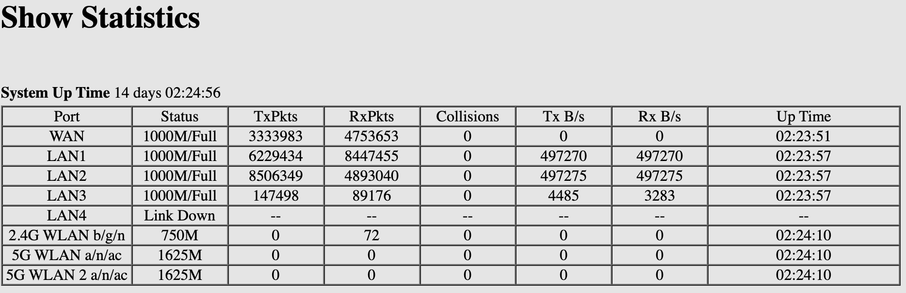
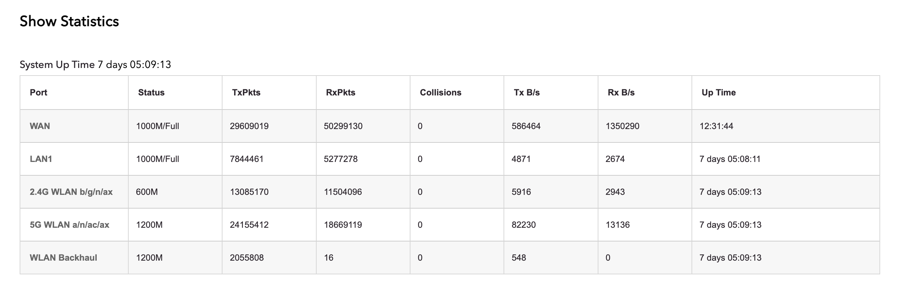

# Netgear Nighthawk Metrics

Prometheus Exporter Netgear Routers.

Tested models
- `Nighthawk MR60 Mesh`
- `Nighthawk R8000P`

## Intro
Parses HTML from http://www.routerlogin.com/RST_stattbl.htm from two router models.

Netgear products have bad customer support and extensibility. If you're reading this, you're probably not going to replace your $300 router right away so I hope this fills a need.

`Nighthawk R8000P` 90s interface



`Nighthawk MR60 Mesh` new UI




## Environment Variables
```
NETGEAR_URL="http://www.routerlogin.com/"
NETGEAR_PASSWORD="admin"
NETGEAR_USERNAME="2"
PORT="8080"
```

Flags
```
--url
--username
--port
```

## Helm Chart Usage
- Add Repository
```
helm repo add connorsapps-netgear https://connorsapps.github.io/netgear-nighthawk-metrics
```

- Install Chart
```
helm install netgear-metrics connorsapps-netgear/netgear-metrics
```

- Delete Chart ☹️
```
helm delete netgear-metrics
```